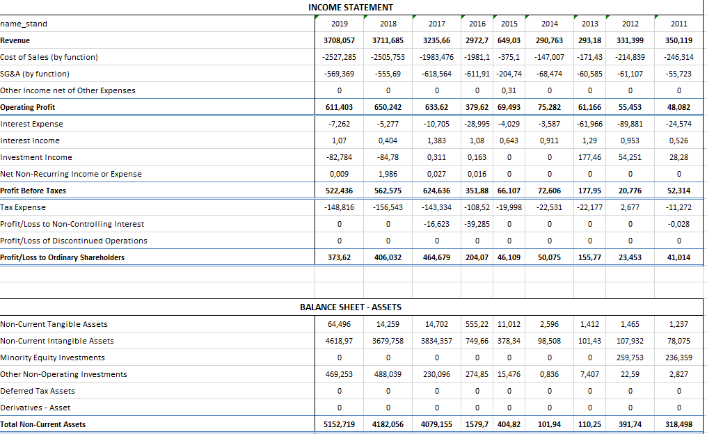
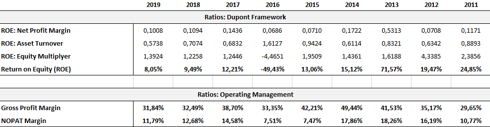

# Description

In this session you will learn how you can combine R programming with analyses that you would normally do in Excel. We will use financial statement here, specifically the **Income Statement**, **Balance Sheet**, and **Cash Flow Statement**. The process described in this session will transform a large number of yearly excel workbooks into single standardized panel data financial statements. In the following we will outsource some more complex transformation to excel and read the results back in. Lastly, we will display results in a simple shiny-app.

Throughout this script we will use custom functions. All the script specific functions are stored in this folder: **1_code/00_functions/f-excel_ratio_analysis.R** (As a reference I also put the important functions in the script)

```{r setup, include=FALSE, purl=FALSE}
knitr::opts_knit$set(root.dir = normalizePath(here::here())) 
knitr::opts_chunk$set(root.dir = normalizePath(here::here())) 
```

# Script Setup

```{r script-setup, message=FALSE, warning=FALSE}
library(tidyverse); library(tidytext); library(readtext); library(furrr)
library(fst); library(stringi); library(ISOcodes); library(scales); library(openxlsx);
library(janitor); library(scales); library(shiny)

source("1_code/00_functions/f-all.R")
source("1_code/00_functions/f-excel_ratio_analysis.R")

.workers <- min(availableCores() / 2, 16)
```

## Paths

```{r paths}
lst_paths <- list(
  dir_main = "2_output/06_excel_ratio_analysis",
  dir_fs = "E:/R/R_projects/MMA22_ACC/0_data/financial_statements",
  path_map_to_stand = "E:/R/R_projects/MMA22_ACC/0_data/map_name_to_name_stand.xlsx",
  path_map_to_id = "E:/R/R_projects/MMA22_ACC/0_data/map_name_stand_to_id.xlsx",
  dir_excel = "2_output/06_excel_ratio_analysis/excel_sheets",
  path_template = "0_data/ratio_template.xlsx",
  path_info = "0_data/orbis_firm_infos.xlsx",
  path_ratios = "2_output/06_excel_ratio_analysis/firm_ratios.rds",
  path_shiny_data = "1_code/shiny/data/firm_ratios.rds",
  path_fs_tables = "2_output/06_excel_ratio_analysis/fs_tables.rds",
  dir_cache = "2_output/06_excel_ratio_analysis/cache/cache_"
) %>% create_dirs()
```

## Files

```{r read-files}
tab_orbis <- read.xlsx(lst_paths$path_info, 2) %>%
  clean_names() %>%
  select(doc_id = company_name_latin_alphabet, industry = us_sic_core_code_description)

tab_files <- list_files_tab(lst_paths$dir_fs, "xlsx") %>%
  mutate(
    year = stri_extract_last_regex(doc_id, "\\d{4}"),
    firm = stri_replace_last_fixed(doc_id, paste0(".", year), "")
  ) 
lst_files <- split(tab_files$path, tab_files$firm)
```

We start by reading the paths to our excel files. In total we have `r comma(nrow(tab_files))` files, which each four relevant sheets, hence we get a total of `r comma(nrow(tab_files) * 4)` excel sheets to process.

Let's have a quick look at one example file.

```{r show-example-file}
# browseURL(tab_files$path[1])
```

## Extract and Combine Financial Statements

Next we use a couple of custom functions: **get_stand_statement()** and **calculate_formula()** to do the heavy lifting and extract structured financial statements from.

<details>

<summary>

Show functions ***(click on arrow to show)***.

</summary>

```{r function: get_stand_statement() and calculate_formula()}
get_stand_statement <- function(.paths, .path_map1, .path_map2) {
  
  lst1 <- list()
  lst2 <- list()
  for (.type in c("is", "bsa", "bsl", "cf")) {
    
    sheet_ <- switch (.type, "is" = 1, "bsa" = 2, "bsl" = 3, "cf" = 4)
    map_1 <- openxlsx::read.xlsx(.path_map1, sheet_) %>%
      select(id, name = name_disp, name_stand) %>%
      mutate(name = trimws(name))
    
    map_2 <- openxlsx::read.xlsx(.path_map2, sheet_) %>%
      mutate(name = trimws(name)) %>%
      rename(name_stand = name)
    
    tab0_ <- map(.paths, ~ openxlsx::read.xlsx(.x, (sheet_ + 1))) %>%
      purrr::reduce(., full_join, by = "name") %>%
      select(-ends_with("y")) %>%
      `colnames<-`(gsub(".x", "", colnames(.), fixed = TRUE))
    cols <- c("name", sort(colnames(tab0_)[-1], decreasing = TRUE))
    tab0_ <- tab0_[, cols]
    tab0_[is.na(tab0_)] <- 0
    
    tab1 <- tab0_ %>%
      mutate(name = trimws(name)) %>%
      left_join(map_1, by = "name") %>%
      arrange(id) %>%
      select(-id)
    
    
    tab2 <- tab1 %>%
      filter(!is.na(name_stand)) %>%
      select(-name) %>%
      group_by(name_stand) %>%
      summarise(across(everything(), ~ sum(., na.rm = TRUE)), .groups = "drop") %>%
      full_join(map_2, by = c("name_stand")) %>%
      arrange(id) %>%
      filter(!id == 0)
    
    if (.type == "cf") {
      is <- lst2$is
      
      tab2[1, -c(1, 11, 12)] <- is[10, -1] - is[6, -1] - is[7, -1]
      tab2[2, -c(1, 11, 12)] <- is[11, -1]
      tab2[8, -c(1, 11, 12)] <- is[7, -1]
      tab2[12, -c(1, 11, 12)] <- is[6, -1]
    } 
    
    tab2 <- calculate_formula(tab2)
    tab2[is.na(tab2)] <- 0
    lst2[[.type]] <- as_tibble(tab2)
    lst1[[.type]] <- as_tibble(select(tab1, -name_stand))
  }
  
  bind_rows(
    enframe(lst1) %>% mutate(type = "Original"),
    enframe(lst2) %>% mutate(type = "Standardized")
  )
  
}

calculate_formula <- function(.tab) {
  
  f <- na.omit(unique(.tab$Calculation))
  for(i in seq_len(length(f))) {
    int <- as.integer(trimws(unlist(stri_split_regex(f[i], "\\=|\\+"))))
    name <- .tab %>%
      filter(id %in% int[1]) %>%
      pull(name_stand)
    
    tab_ <- .tab %>%
      filter(id %in% int[-1]) %>%
      select(-Calculation) %>%
      mutate(name_stand = name, id = int[1]) %>%
      group_by(id, name_stand) %>%
      summarise(across(everything(), ~ sum(., na.rm = TRUE)), .groups = "drop")
    
    .tab <- bind_rows(tab_, .tab) %>%
      distinct(id, .keep_all = TRUE)
  }
  .tab %>%
    arrange(id) %>%
    select(-Calculation, -id)
}
```

</details>

<br><br> Additionally we have two mapping tables that we use:

Mapping Table 1: Map Line Items to Standardized Line Items The table below shows the mapping table for the income statement.

```{r show-map1}
read.xlsx(lst_paths$path_map_to_stand, 1) %>%
  mutate(across(where(is.character), ~ if_else(is.na(.), "", .))) %>%
  show_table()

# browseURL(lst_paths$path_map_to_stand)
```

Mapping Table 2: Map Standardize Line Items to ID The table below shows the mapping table for the income statement.

```{r show-map2}
read.xlsx(lst_paths$path_map_to_id, 1) %>%
  mutate(across(where(is.character), ~ if_else(is.na(.), "", .))) %>%
  show_table()

# browseURL(lst_paths$path_map_to_id)
```

With those mapping tables and custom functions we are able to generate nice looking standardized financial statements on a company level.

```{r extract-fs}
if (!file.exists(lst_paths$path_fs_tables)) {
  plan("multisession", workers = .workers)
  lst_fs <- future_map(
    .x = lst_files,
    .f = ~ get_stand_statement(.x, lst_paths$path_map_to_stand, lst_paths$path_map_to_id),
    .options = furrr_options(seed = TRUE),
    .progress = TRUE
  )
  plan("default")
  write_rds(lst_fs, lst_paths$path_fs_tables)
} else {
  lst_fs <- read_rds(lst_paths$path_fs_tables)
}
```

```{r show-fs-example}
show_table(lst_fs[[1]]$value[5])
```

## Write Financial Statements to Excel

In the next step we lever the full power of the intersection between excel and R. Having the financial statements in a list is only the first step, because in most use cases we want to have nicely formatted Excel files, that we can share with our collegues or with which we can do further ad-hoc analyses. To do this we again use a set of custom functions to write our financial statements in a pre-formatted Excel template.

<details>

<summary>

Show functions ***(click on arrow to show)***.

</summary>

```{r function: write_to_excel() and calculate_wb_fn()}
write_to_excel <- function(.tab, .name, .dir, .template) {
  wb <- openxlsx::loadWorkbook(.template)
  
  .row <- 1
  openxlsx::writeData(wb, "Original Statements", .tab$value[[1]], startRow = .row)
  .row <- .row + nrow(.tab$value[[1]]) + 3
  openxlsx::writeData(wb, "Original Statements", .tab$value[[2]], startRow = .row, colNames = FALSE)
  .row <- .row + nrow(.tab$value[[2]]) + 1
  openxlsx::writeData(wb, "Original Statements", .tab$value[[3]], startRow = .row, colNames = FALSE)
  .row <- .row + nrow(.tab$value[[3]]) + 3
  openxlsx::writeData(wb, "Original Statements", .tab$value[[4]], startRow = .row, colNames = FALSE)
  openxlsx::setColWidths(wb, "Original Statements", cols = 1:ncol(.tab$value[[1]]), widths = "auto")
  
  
  openxlsx::writeData(wb, "Standardized Statements", .tab$value[[5]], startRow = 2)
  openxlsx::writeData(wb, "Standardized Statements", .tab$value[[6]], startRow = 20, colNames = FALSE)
  openxlsx::writeData(wb, "Standardized Statements", .tab$value[[7]], startRow = 36, colNames = FALSE)
  openxlsx::writeData(wb, "Standardized Statements", .tab$value[[8]], startRow = 53, colNames = FALSE)
  
  path_ <- file.path(.dir, paste0(.name, ".xlsx"))
  openxlsx::saveWorkbook(wb, path_, overwrite = TRUE)
  
  # .dir  = dirname(path_)
  # .name = basename(path_)
  calculate_wb_fn(dirname(path_), basename(path_))
  
}

calculate_wb_fn <- function(.dir, .name) {
  dir_ <- normalizePath(.dir)
  hash_ <- digest::digest(.name, algo = "xxhash32")
  
  path_vbs_ <- normalizePath(file.path(dir_,  paste0(hash_, ".vbs")), mustWork = FALSE)
  path_xlsx_ <- normalizePath(file.path(dir_,  .name), mustWork = FALSE)
  
  macro_calculate_wb <- file(path_vbs_)
  writeLines(c("Const xlVisible = -1",
               "Dim objExcel",
               "Dim objWb",
               "Dim objws",
               "Dim strFileName",
               paste0("strFileName = \"", path_xlsx_,"\""),
               "On Error Resume Next",
               "Set objExcel = CreateObject(\"excel.application\")",
               "Set objWb = objExcel.Workbooks.Open(strFileName)",
               "objExcel.DisplayAlerts = False",
               "objWb.Save",
               "objWb.Close SaveChanges=True",
               "objExcel.Close",
               "objExcel.Quit",
               "set objWb = Nothing",
               "set objExcel = Nothing",
               "On Error GoTo 0")
             , macro_calculate_wb)
  close(macro_calculate_wb)

  shell(shQuote(string = path_vbs_), wait = T, mustWork = TRUE, intern = TRUE)
  
  file.remove(path_vbs_)
}
```

</details>

<br><br> Applying this approach gives us another advantage, namely that we can use our known procedure in Excel to calculate relevant ratios, and do not have to re-program everything in R (which can be cumbersome in comparison to Excel)

```{r write-excel-files}
.prc <- list_files_tab(lst_paths$dir_excel)
lst_fs_use <- lst_fs[!names(lst_fs) %in% .prc$doc_id]
if (length(lst_fs_use) > 0) {
  plan("multisession", workers = .workers)
  future_iwalk(
  .x = lst_fs_use, 
  .f = ~ write_to_excel(.x, .y,  lst_paths$dir_excel, lst_paths$path_template),
  .options = furrr_options(seed = TRUE),
  .progress = TRUE
  )
  plan("default")
}

tab_files_std <- list_files_tab(lst_paths$dir_excel)
```

Let's look at an example output

```{r}
# browseURL(tab_files_std$path[2])
```





## Read Results

Last we read in the results we obtained by executing the excel formulae. We won't show any results here, but switch to another approach, namely using reactive programming to build a so-called shiny app.

```{r read-results, cache=TRUE, cache.path = lst_paths$dir_cache}
tab <- map_dfr(
  .x = set_names(tab_files_std$path, tab_files_std$doc_id),
  .f = ~ openxlsx::read.xlsx(.x, colNames = FALSE, sheet = 3),
  .id = "doc_id"
) %>%
  `colnames<-`(c("doc_id", "Ratio", 2019:2011)) %>%
  filter(!is.na(Ratio), !startsWith(Ratio, "Ratio"), !is.na(`2019`)) %>%
  pivot_longer(matches("\\d{4}"), names_to = "year") %>%
  left_join(tab_orbis, by = "doc_id")

write_rds(tab, lst_paths$path_ratios)
write_rds(tab, lst_paths$path_shiny_data, compress = "gz")
```

## Load shiny

Unfortunately, you can't see the results on the website, since it requires a server to do the calculation.

```{r}
# shiny::runApp("1_code/shiny/app.R")
```


# Own Function Calls

```{r function-calls}
lsf.str()
```

------------------------------------------------------------------------

# Session Info

```{r session-info}
sessioninfo::session_info()
```